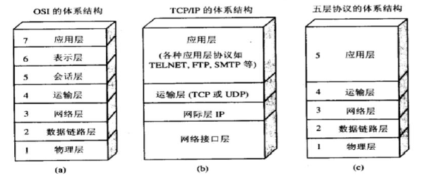

# 概述

## 一般概念

1. 计算机网络向用户提供的最重要的功能（计算机网络系统基本组成）: 
    * 连通性（通信子网）
    * 资源共享（资源子网）
1. 计算机网络和互联网是不同的：
    * 计算机网络（network)： 由若干结点(node)和连接这些结点的链路(link）组成
    * 网络和网络还可以通过**路由器**互连起来， 这样就构成了一个覆盖范围更大的网络， 即互联网（internet）。
1. 与网络相连的计算机称为 **主机**
1. 端系统通信方式分类：
    * 客户-服务器（C/S）方式
    * 对等方式（P2P）
1. 若中央处理机之间的距离非常近（如仅一米或更小），则一般称之为多处理机系统而非计算机网络。
1. 协议数据单元PDU：对等层次之间传送的数据单位。
1. 服务数据单元SDU：层与层之间交换的数据单位。

## 重要概念

1. **交换方式**：
    * 特点
        * 电路交换：通话的全部时间内， 通话的两个用户始终占用端到端的通信资源。线路的传输效率往往很低。
        * 分组交换：采用**存储转发**技术。比报文交换的时延小， 同时也具有更好的灵活性。
        * 报文交换：时延较长，已经很少有人使用。
    * 三种交换方式在**数据传送阶段**的主要特点：
        * 电路交换：整个报文的比特流连续地从源点直达终点， 好像在一个管道中传送。
        * 报文交换：**整个**报文先传送到相邻结点，**全部存储**下来后查找转发表， 转发到下一个结点。
        * 分组交换：**单个分组**（这只是整个报文的*一部分* ） 传送到相邻结点， 存储下来后查找转发表， 转发到下一个结点。
1. 按作用范围分类：
    * 广域网（WAN）：作用范围通常为几十到几千公里。是因特网的核心部分， 其任务是通过长距。
    * 城域网（MAN）：作用范围一般是一个城市，5~50km。多采用以太网技术。
    * 局域网（LAN）：局限在较小的范围，1km左右。
    * 个人区域网（PAN）：在 *个人工作* 地方把 *属于个人使用* 的电子设备用 *无线技术* 连接起来的网络，因此也常称为无线个人区域网WPAN（Wireless PAN）。
1. 七个性能指标：
    1. 速率：数据传输速率。也称“数据率”或“比特率”。**最重要的**一个性能指标。**注意！速率的单位如1K、1M是指10进制的103bit/s、106bit/s。而数据的单位如1KB或1MB指的是2进制的210×8bit、220×8bit**。
    1. 带宽： 是数字信道所能传送的“最高数据率”。单位是“比特每秒”，或b/s (bit/s)。
    1. 吞吐量：在 *单位时间* 内通过某个网络的数据量。
    1. 时延：指数据从网络的一端传送到另一端所需的时间。由以下四部分时延加和而组成：
        * 发送时延：主机或路由器发送数据帧所需要的时间。计算：**数据帧长度(bit)/发送速率(bit/s)**
        * 传播时延：电磁波在信道中传播一定的距离需要花费的时间。计算：**信道长度(m)/电磁波在信道的传输速率(m/s)**。
        * 排队时延：分组在进入路由器后，要先在输入队列中排队等待处理，还要在输出队列中排队等待转发。这就产生了排队时延。
        * 处理时延：收到分组时要花费一定的时间进行处理。
    1. 时延带宽积：表示这样的链路可容纳多少个比特。即，若设时延带宽积为P，发送端连续发送数据， 则在发送的第一个比特即将达到终点时， 发送端就已经发送了P个比特，而这P个比特都正在链路上向前移动。计算：**传播时延×带宽**
    1. 往返时间RTT：从发送方发送数据开始，到发送方收到来自接收方的确认（ 接收方收到数据后便立即发送确认），总共经历的时间。
    1. 利用率：计算：**网络空闲时延=网络当前时延×(1-利用率)**
1. 协议
    * 什么是协议：协议是控制两个对等实体（或多个实体）进行通信的规则的集合。在协议的控制下，俩个对等实体间的通信使得本层能够向上一层提供服务。
    * 协议的三要素：
        * 语法：即数据与控制信息的结构或格式；
        * 语义：即需要发出何种控制信息， 完成何种动作以及做出何种响应；
        * 同步：即事件实现顺序的详细说明。
1. 体系结构：
    * 什么是体系结构：计算机网络的各层及其协议的集合，称为网络的体系结构。
    * 体系结构图：

    * 五层结构
        * 应用层：直接为用户的应用进程提供服务。
        * 运输层：负责向两个主机中进程之间的通信提供服务。**主要使用UDP和TCP协议**
        * 网络层：为分组交换网上的不同主机提供通信服务。把运输层产生的报文段或用户数据报封装成分组或包进行传送。网络层也叫做网际层或IP层。
        * 数据链路层：将网络层交下来的IP数据报组装成帧，在两个相邻结点间的链路上“透明” 地传送帧中的数据。
        * 物理层: 是透明地传送比特流。**请注意， 传递信息所利用的一些物理媒体， 如双绞线、同轴电缆、光缆、无线信道等，并不在物珅层协议之内而是在物理层协议的下面。因此也有人把物理媒体当做第0 层。**

## 名词解释

1. WWW（万维网）：由欧洲原子核研究机构开发的万维网，是一个由许多互相链接的超文本组成的系统，通过互联网访问。

## 简答题

1. 实体、协议、服务和服务访问点是什么。
    * 实体表示任何可发送或接收信息的硬件或软件进程。在许多情况下，实体就是一个特定的软件模块。
    * 协议是控制两个对等实体(或多个实体)进行通信的规则的**集合**。
        * 在协议的控制下，两个对等实体间的通信使得本层能够 *向上一层* **提供**服务。要实现本层协议，还需要**使用** *下面一层* 所提供的服务。
        * 使用本层服务的实体只能看见服务而无法看见下面的协议。下面的协议对上面的实体是透明的。
        * 协议是水平的，即协议是控制对等实体之间通信的规则。
    * 只有那些能够被高一层实体“看得见”的功能才能称为服务。服务是垂直的，即服务是由下层向上层通过层间接口提供的。
    * 在同一系统中相邻两层的实体进行交互(即交换信息)的地方，通常称为服务访问点SAP(Service Access Point)。
1. 简述对等网模式(P2P)、客户/服务器模式(C-S)、浏览器服务器模式(B-S)特点。
    * 在对等网中没有专用的服务器、每台计算机地位平等、每台计算机既可充当服务器又可充当客户机的网络工作模式。
    * 在C/S 和B/S 模式中，计算机被分为服务器和客户机两种，服务器负责为全体客户机提供有关服务，而客户机负责向服务器发送服务请求并处理相关事务。
        * 在C/S 模式中，用户请求的任务有服务器端程序与客户端应用程序共同完成，不同的任务要安装不同的客户端软件。
        * 在B/S 模式中，客户端只需要安装浏览器，用户通过浏览器向服务器发送请求，然后服务器接收并进行相应的处理后将结果返回给浏览器显示。

## 计算题

### 0x01
---

试在下列条件下比较电路交换和分组交换。要传送的报文共x(bit) 。从源点到终点共经过k段链路，每段链路的传播时延为d (s), 数据率为b (b/s) 。在电路交换时电路的建立时间为s (s) 。在分组交换时分组长度为p (bit) , 且各结点的排队等待时间可忽略不计。问在怎样的条件下， 分组交换的时延比电路交换的要小？

**解：**

对于电路交换，因为是从源点持续到达终点，所以其时延由三部分组成：电路的建立时间s，发送时延 x/b，以及传播时延kd。即总时延 s+kd+x/b。
