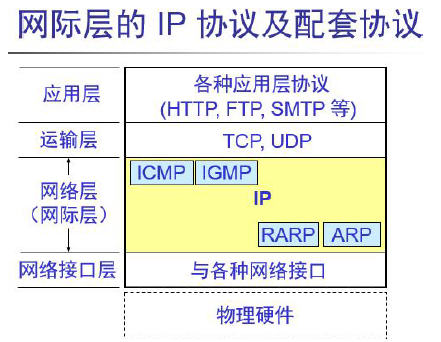
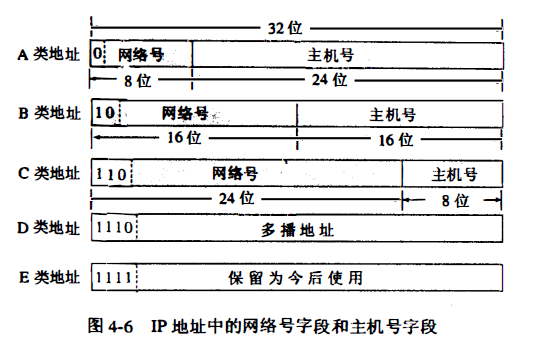

# 第四章 网络层（网际层或称为IP层）

## 一般概念

1. 网络层：
    * 向上只提供简单灵活的、无连接的、尽最大努力交付的数据报服务。
    * 网络在发送分组时不需要先建立连接。
    * 每一个分组独立发送， 与前后的分组无关。 网络层不提供服务质量的承诺。
    * 所传送的分组可能出错、丢失、重复和失序（ 即不按序到达终点），当然也不保证分组交付的时限
1. IP地址：给因特网上的每一个主机（或路由器） 的每一个接口分配一个在全世界范围是 *唯一的* **32位**的标识符。
1. 网际层的IP协议及配套协议：
    * 与IP协议配套使用的四个协议：
        * 地址解析协议ARP (Address Resolution Protocol)
        * 逆地址解析协议RARP (Reverse Address Resolution Protocol)
        * 网际控制报文协议ICMP (Internet Co ntrol Message Protocol)
        * 网际组管理协议IGMP (Internet Group Management Protocol)
    * 示意图：

        

        ARP 和RARP 画在最下面，因为IP 经常要使用这两个协议。ICMP 和IGMP 画在这一层的上部， 因为它们要使用IP 协议。
1. 为什么把网络层称为IP层？
    由于网际协议IP 是用来使互连起来的许多计算机网络能够进行通信， 因此TCP/IP体系中的网络层常常称为网际层或IP层。
1. 辨析：Ip地址和硬件地址
    * 物理地址是数据链路层和物理层使用的地址
    * IP 地址是网络层和以上各层使用的地址， 是一种逻辑地址
    * IP地址放在IP数据报的首部， 而硬件地址则放在MAC帧的首部
    * 使用IP地址的IP数据报一旦交给了数据链路层， 就被封装成MAC帧了。
1. 路由器：
    * 路由选择部分（控制部分）：路由选择处理机
    * 分组转发部分
        * 交换结构
            * 通过存储器
            * 通过总线
            * 通过互连网络
        * 一组输入端口
        * 一组输出端口
1. 多播：由一个源点发送到许多个终点， 即一对多的通信。
1. 网桥和路由器的区别：
    1. 网桥是第二层的设备，而路由器是第三层的设备；
    2. 网桥只能连接两个相同的网络，而路由器可以连接不同网络；
    3. 网桥不隔离广播，而路由器可以隔离广播。

## 重点概念

1. 网络层（或IP层）的作用：实现两个端系统之间的数据透明传送，具体功能包括寻址和路由选择、连接的建立、保持和终止等。
1. 网络设备及其工作层次
    <table>
    <tr><th>设备名称</th><th>工作层次</th><tr>
    <tr><td>转发器(repeater)</td><td>物理层</td></tr>
    <tr><td>网桥或桥接器(bridge)</td><td>数据链路层</td></tr>
    <tr><td>路由器(router)</td><td>网络层</td></tr>
    <tr><td>网关(gateway)</td><td>在网络层以上</td></tr>    
    </table>
1. 虚电路服务与数据报服务的对比
    <table style="text-align:center">
    <tr><th>对比的方面</th><th>虚电路服务</th><th>数据报服务</th></tr>
    <tr><td>思路</td><td>可靠通估应当由网络来保证</td><td>可靠通信应当由用户主机来保证</td></tr>
    <tr><td>连接的建立</td><td>必须有</td><td>不需要</td></tr>
    <tr><td>终点地址</td><td>仅在连接建立阶段使用，每个分组使用短的重点地址</td><td>每个分组都有终点的完整地址</td></tr>
    <tr><td>分组转发</td><td>属于同一条虚电路的分组按照同一路由转发</td><td>每个分组独立选择分组转发</td></tr>
    <tr><td>结点有故障</td><td>通过该节点的所有虚电路都不能工作</td><td>出故障的节点可能会丢失分组，一些路由可能会发生变化</td></tr>
    <tr><td>分组顺序</td><td>按照顺序</td><td>不一定按照顺讯</td></tr>
    <tr><td>差错处理</td><td>由网络或用户主机负责</td><td>由用户主机负责</td></tr>
    </table>
1. 分类的IP地址：
    * 共32位，由**网络号+主机号**构成
    * 单播地址：
        * A类：
            * 8位网络号（标识位0）
            * 24位主机号
        * B类：
            * 16位网络号（标识位10）
            * 16位主机号
        * C类：
            * 24位网络号（标识位110）
            * 8位主机号
    * 多播地址：
        * D类：
            * 标识位1110
    * 保留以后使用
        * E类：
            * 标识位1111

    
1. 特殊IP
    <table>
    <tr>
        <th style="width:16mm">网络号</th>
        <th style="width:16mm">主机号</th>
        <th style="width:16mm">是否可用于源地址</th>
        <th style="width:16mm">是否可用于目的地址</th>
        <th style="width:16mm">代表意思</th>
        <th>说明</th>
    </tr>
    <tr><td>0</td><td>0</td><td>可以</td><td>可以</td><td>本网络的本主机</td><td>本机地址</td></tr>
    <tr><td>0</td><td>特定(不等于255)</td><td>可以</td><td>不可</td><td>本网络上的指定主机</td><td>发送的分组被限制在本网络内，由特定的主机号对应的主机接收</td></tr>
    <tr><td>255</td><td>255</td><td>不可</td><td>可以</td><td>受限广播地址</td><td>有时需要在本网络内部广播。受限的广播地址是255.255.255.255。该地址用于主机配置过程中IP数据报的目的地址，此时，主机可能还不知道它所在网络的网络掩码，甚至连它的IP地址也不知道。在任何情况下，路由器都不转发目的地址为受限的广播地址的数据报，这样的数据报仅出现在本地网络中。</td></tr>
    <tr><td>特定</td><td>255</td><td>不可</td><td>可以</td><td>直接广播地址</td><td>对指定的网络号对应的网络上的所有主机进行广播</td></tr>
    <tr><td>特定</td><td>0</td><td>不可</td><td>不可</td><td>网络地址</td><td>不分配给任何主机，仅表示特定某个网络的网络地址</td></tr>
    <tr><td>127</td><td>非255或0的其他任何数</td><td>可以</td><td>可以</td><td>环回地址</td><td>协议软件不会将其送网络，而是将其送回。用于本机网络软件测试和本机进程通信。</td></tr>
    </table>

1. A类地址：
    * 网络号：A类网络号8位，第一位是标志位固定位0，所以只有7位可用。从上表中知道，可指派的网络号，不能为0（0000-0000），也不能为127（0111-1111），因此最大可指派的网络数为2<sup>7</sup>-2=126。
        * 第一个可指派的网络号：1（000-0001）
        * 最后一个可指派的网络号：126（0111-1110）
    * 主机数：A类主机号有24位。从表中可知主机数不能全为1不能全为0，所以可分派的主机数有2<sup>24</sup>-2=16777214
    * 占整个IP空间的50%
1. B类地址：
    * 网络号：B类地址网络号有16位，前两位固定为10，有14位可以分配，因为B网络号不可能全为0或全为1。但是规定128.0.0.0是不指派的，所以可指派网络数为2<sup>14</sup>-1=16383。
        * 第一个可指派的网络号：128.1（10000000-00000001）
        * 最后一个可指派的网络号：191.255（10111111-11111111）
    * 主机数：B类主机号有16位。所以可分派的主机数有2<sup>16</sup>-2=65534
    * 占IP地址空间的25%
1. C类地址
    * 网络号：C类地址网络号有24位，前3位110固定，则有21位可选。192.0.0.0不指派，所以可指派网络数是所以可分派的主机数有2<sup>21</sup>-1=2097151。
        * 第一个可指派的网络号：192.0.1（11000000-00000000-00000001）
        * 最后一个可指派的网络号：223.255.255（11011111-11111111-11111111）
    * 主机数：B类主机号有8位。所以可分派的主机数有2<sup>8</sup>-2=254
    * 占IP地址空间的12.5%
1. 单播地址可指派的范围总结
    <table>
    <tr>
    <th>类别</th>
    <th>范围</th>
    <tr>
    <tr>
    <td>A类</td>
    <td>1.x.x.x~126.x.x.x</td>
    </tr>
    <tr>
    <td>B类</td>
    <td>128.1.x.x~191.255.x.x</td>
    </tr>
    <tr>
    <td>C</td>
    <td>192.0.1.x~223.255.255.x</td>
    </tr>
    </table>
1. ARP地址解析协议：
    * 作用：根据IP地址获取物理地址，减少网络上的通信量。
    * ARP高速缓存作用：映射IP地址到硬件地址。
    * 过程：
        1. 同一局域网内：
            
            当主机A要向 **本局域网** 上的某个主机B发送IP数据报时， 就先在其ARP高速缓存中查看有无主机B的IP地址。
            * 若有，则就在ARP高速缓存中查出其对应的硬件地址， 再把这个硬件地址写入MAC帧， 然后通过局域网把该MAC帧发往此硬件地址。
            * 若没有，则：
                1. ARP进程在本局域网上**广播发送**一个**ARP请求分组**。主要内容是表明： “我的IP 地址是xxx, 硬件地址是xxx。 我想知道IP 地址为xxx的主机的硬件地址。”
                1. 在本局域网上的**所有主机**上运行的ARP进程都收到此ARP请求分组。
                1. 主机B 在ARP请求分组中见到自己的IP地址，就向主机A发送**ARP响应分组**，并写入自己的硬件地址。其余的所有主机都不理睬这个ARP请求分组，
                1. 主机B把主机A附加在ARP请求分组中的主机A的地址映射写入主机B自己的ARP高速缓存中
                1. 主机A收到主机B的ARP响应分组后， 就在其ARP高速缓存中写入主机B的IP地址到硬件地址的映射。
            * ARP请求分组是广播发送的，但ARP响应分组是普通的单播， 即从一个源地址发送到一个目的地址。
        1. 不同局域网中：
            
            1. 主机A发送给B的IP数据报首先需要通过与主机A连接在同一个局域网上的**路由器R1**来转发。
            1. 此主机a这时需要把路由器R1的IP地址解析为硬件地址，以便能够把IP数据报传送到路由器R1。
            1. R1从转发表找出了下一跳路由器R2，同时使用ARP解析出R2的硬件地址。于是IP数据报按照硬件地址转发到路由器R2
            1. 路由器R2在转发这个IP数据报时用类似方法解析出目的主机B的硬件地址，使IP数据报最终交付给主机B。
    * ARP命令：
        * ```arp -a```：显示所有接口的当前 ARP 缓存表。
        * ```arp -d InetAddr [IP地址]```：删除指定的IP地址项。
        * ```arp -d *```：删除所有项

1. 子网掩码：
    * 作用：
        1. 用于屏蔽IP地址的一部分，以区别网络标识和主机标识，并说明该IP地址是在局域网上，还是在远程网上。
        1. 用于将一个大的IP网络划分为若干小的子网络。
    * 默认子网掩码：
        * A类：0xFF-00-00-00
        * B类：0xFF-FF-00-00
        * C类：0xFF-FF-FF-00
    * 若在某地址的子网划分中，子网号位数是n，则子网数有**2<sup>n</sup>-2**个，该地址的主机号为m位，则每个子网的主机数是**2<sup>m-n</sup>-2**个。减2是因为子网号和子网主机号共同占有原先二级IP的主机号，而该主机号作为合法IP不允许全0或全1，因此要减去。
    * 同样的IP，不同的子网掩码可以得出**相同的**网络地址。
1. 前缀长度为n的CIDR，相当于2<sup>24-n</sup>个C类，或者2<sup>16-n</sup>个B类。显然，网络前缀越短，地址块所包含的地址数就越多。
1. 最长前缀匹配：在使用CIDR时， 由于采用了网络前缀这种记法。在查找路由表时可能会得到不止一个匹配结果，应当从匹配结果中选择具有最长网络前缀的路由。
1. ICMP协议：
    * 形式：作为IP层数据报的数据，加上数据报的首部，组成**IP数据报**发出去的。
    * 作用：用于在主机、路由器之间传递控制消息,包括报告错误、交换受限控制和状态信息等。
    * 分类：
        * ICMP差错报文
            * 终点不可达
            * 时间超过
            * 参数问题
            * 改变路由（重定向）
        * ICMP询问报文
            * 回送请求和回答
            * 时间戳请求和回答
1. 分层次的路由选择协议： 
    * 内部网关协议IGP：即在一个自治系统内部使用的路由选择协议。如RIP和OSPF协议。
    * 外部网关协议EGP：当数据报传到一个自治系统的边界时， 就需要使用一种协议将路由选择信息传递到另一个自治系统中。如BGP-4
1. RIP：路由信息协议
    * 形式：使用运输层的用户数据报UDP进行传送，端口520（即RIP协议封装在UDP报文中，UDP报文再封装入IP数据报中）
    * 分布式的**基于距离向量**的路由选择协议
    * 一条路径只能**最多**包含15个路由器，跳数为16认为不可达。
    * 只适用于小型互联网。
    * 特点：
        * 仅和相邻路由器交换信息。
        * 交换的信息是当前本路由器所知道的全部信息，即自己的路由表。
        * 按固定的时间间隔交换路由信息
1. OSPF：开放最短路径优先
    * 形式：直接用IP数据报传送
    * 分布式的**链路状态**协议
    * 特点：
        * 向本自治系统中**所有路由器**发送信息。这里使用的方法是洪泛法
        * 发送的信息就是与本路由器**相邻的**所有路由器的链路状态，但这只是路由器所知道的**部分信息**。
        * 只有当链路状态发生变化时， 路由器才向所有路由器用洪泛法发送此信息。
1. OSPF：所有路由器最终都可以建立一个全网的拓扑结构
    
    RIP：不知道全网的拓扑结构
1. BGP：
    * 力求找到能够到达目的地且比较好的路由，不一定要最佳。
    * 不同AS的路由器之间交换路由信息的协议。
    * 路径向量路由选择协议
    * 过程：
        1. 一个BGP发言人与其他AS的BGP发言人要交换路由信息， 就要先建立TCP 连接（端口号为179)
        1. 在此连接上交换BGP报文以建立BGP会话，利用BGP会话交换路由信息。
1. IPv6
    * 地址长度：128位
    * 与IPv区别：
        1. 更大的地址空间
        1. 扩展的地址层次结构
        1. 灵活的首部格式
        1. 改进的选项
        1. 允许协议继续扩充
        1. 支持即插即用
        1. 支持资源的预分配
        1. 首部改为8字节对齐（IPv4是4字节对齐）
1. 专用地址：只能用作本地地址而不能用作全球地址。在因特网中的所有路由器， 对目的地址是专用地址的数据报一律不进行转发。
    * 10.0.0.0 到10.255.255.255
    * 172.16.0.0 到172.31.255.255
    * 192.168.0.0 到192.168.255.255
1. 专用网：采用这样的专用IP地址的互连网络称为专用互联网或本地互联网
1. VPN：虚拟专用网
    * 定义：利用公用的因特网作为本机构各专用网之间的**通信载体**，这样的专用网又称为虚拟专用网
    * 目的：降低成本、传输数据安全可靠、连接方便灵活、完全控制。
1. NAT：网络地址转换
    
    通过在专用网连接到因特网的路由器上安装NAT 软件，这样，所
有使用本地地址的主机在和外界通信时，都要在NAT 路由器上将其本地地址转换成全球IP 地址，才能和因特网连接。

## 简答题

1. 简述在划分子网的情况下路由器转发分组的算法。
    1. 从收到的数据报的首部提取目的IP 地址D
    1. 先判断是否为直接交付。对路由器直接相连的网络逐个进行检查：用各网络的子网掩码和D 逐位相“与”，看结果是否和相应的网络地址匹配。若匹配，则把分组进行直接交付(当然还需要把D 转换成物理地址，把数据报封装成帧发送出去)，转发任务结束。否则就是间接交付，执行(3)
    1. 若路由表中有目的地址为D 的特定主机路由，则把数据报传送给路由表中所指明的下一条路由器；否则，执行(4)
    1. 对路由表中的每一行（目的网络地址，子网掩码，下一跳地址），用其中的子网掩码和D 逐位相“与”，其结果为N。若N 与该行的目的网络地址匹配，则把数据报传送给该行指明的下一跳路由器；否则，执行(5)
    1. 若路由表中有一个默认路由，则把数据报传送给路由表中所指明的默认路由器；否则，执行(6)
    1. 报告转发分组出错
1. 简述子网和超网作用及其区别，为什么说给每一个物理网络分配一个网络号会使路由表变得太大而使网络性能变坏？
    1. 早期IP地址由网络号和主机号组成，这种方法同时存在两个主要问题:
        1. IP 地址有效利用率很低
        1. 路由器工作效率很低。
    
        在IP 地址中增加一个“**子网号字段**”，使两级IP地址变为三级IP 地址，它能够较好地解决上述问题，并且使用起来也很灵活，这种做法叫做**划分子网**。
    
    1. 每一个CIDR 地址块中的地址数一定是2的整数次幂。除最后几行外，CIDR 地址块都包含了多个C类地址（是一个C类地址的2<sup>n</sup>倍，n 是整数），这就是“构成超网“这一名词的来源。
    
    1. 如果路由表过大，则为了找到一个IP 包的下一个转发路由所必须进行的匹配操作数也随之增大，这将加大路由器工作负担，也造成了更长的转发时延，从而导致网络性能变坏。