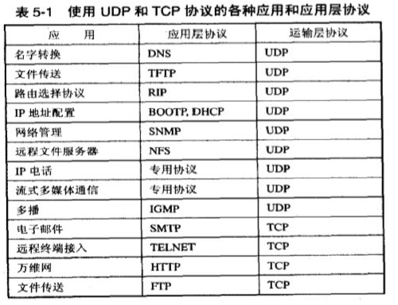
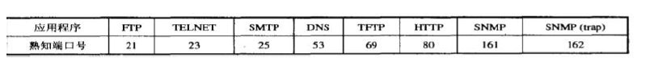
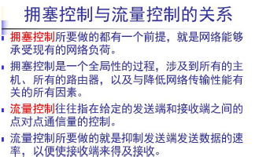

# 第五章 运输层

## 一般概念

1. 网络层是为**主机之间**提供逻辑通信，而运输层为**应用进程**之间提供端到端的逻辑通信

## 重要概念

1. 网络层，IP 数据报首部中的校验和字段，只检验首部是否出现差错而不检查数据部分。运输层还要对收到的报文进行差错检测。
1. UDP 在传送数据之前**不需要**先建立连接。
1. TCP 则提供面向连接的服务。在传送数据之前必须先建立连接，数据传送结束后要释放连接。TCP 不提供广播或多播服务。
1. 
1. 常用端口号几个协议的名称
    
1. 停止等待协议
    1. 无差错情况：A 发送分组M1，发完就暂停发送，等待B的确认。B 收到了M1就向A发送确认。A在收到了对M1的确认后，就再发送下一个分组M2
    1. 出现差错：A只要超过了一段时间仍然没有收到确认， 就认为刚才发送的分组丢失了，因而重传前面发送过的分组。在每发送完一个分组设置一个超时计时器。如果在超时计时器到期之前收到了对方的确认， 就撤销己设置的超时计时器。
    1. 确认丢失和确认迟到：B收到了A发来的信息，但是发回给A的确认信息A没有收到，A在超时计时器到期后就要重传，B 又收到了重传的数据。这时应采取两个行动：第一， 丢弃这个重复的分组，不向上层交付。第二，向A发送确认。
1. TCP 的流量协议是用**滑动窗口**来控制的
1. TCP的拥塞控制方法
    * 慢开始
    * 拥塞避免
    * 快重传
    * 快恢复
1. 确认ACK：仅当ACK=1时确认号字段才有效。当ACK = 0时，确认号无效。TCP 规定，在连接建立后所有传送的报文段都必须把ACK置1 。
1. 同步SYN：在连接建立时用来同步序号
    * 当SYN = 1 而ACK=0 时：表明这是一个**连接请求**报文段。
    * 对方若同意建立连接，**响应的报文**段中使 SYN=1和ACK=1。

## 简答题：

1. TCP和UDP的区别。
    1. TCP面向连接;UDP是无连接的，即发送数据之前不需要建立连接
    1. TCP提供可靠的服务。也就是说，通过TCP连接传送的数据，无差错，不丢失，不重复，且按序到达; UDP尽最大努力交付，即不保证可靠交付
    1. UDP具有较好的实时性，工作效率比TCP高，适用于对高速传输和实时性有较高的通信或广播通信。
    1. 每一条TCP连接只能是点到点的; UDP支持一对一，一对多，多对一和多对多的交互通信
    1. TCP对系统资源要求较多，UDP对系统资源要求较少。
1. 拥塞与流量的异同
    * 拥塞：Σ对资源的需求>可用资源
    * 
1. FTP 的基本工作原理：
    1. 打开熟知端口（端口号为21 ) , 使客户进程能够连接上。
    1. 等待客户进程发出连接请求。
    1. 启动从属进程来处理客户进程发来的请求。从属进程对客户进程的请求处理完毕后即止， 但从属进程在运行期间根据需要还可能创建其他一些子进程。
    1. 回到等待状态， 继续接受其他客户进程发来的请求。主进程与从属进程的处理是并发地进行。
1. 连续ARQ 协议中设编号用三位（000-111），假设发送窗口为8，试找出一种情况，在此情况下协议不能正常工作，并分析连续ARQ 协议是否一定优于停止等待协议？(P214-216)

    答：这种情况是若所有确认帧都正确到达发送端，发送端又发送8 个新的数据帧，其编号应是0-7，而一旦所有确认帧都丢失，经过一段时间后，发送端重传这8 个旧的数据帧，其编号仍为0-7，显然接收端第二次收到编号0-7 这8 个数据帧时无法判定这是8 个是新的数据帧还是旧的重传数据帧连续ARQ 协议一方面因连续发送数据而提高了效率，但另一方面，重传时又必须把原来已正确传送过的数据帧进行重传，仅因这些数据帧之前有一个数据帧出现了错误，这种做法又使传送效率降低，由此可见若传输信道的传输质量很差，因而误码率较大时，连续ARQ协议不一定优于停止等待协议。
1. 某个应用进程使用运输层的用户数据报UDP，然后继续向下交给IP 层后，又封装成IP 数据报。既然都是数据报，是否可以跳过UDP 直接交给
IP 层？哪些功能UDP 提供了但IP 没有提供？
    
    答：不可以，IP 数据报只能找到目的主机而不能找到目的进程。UDP 提供对应用进程的复用和分用功能，以及提供对数据部分的差错检测。
1. 为何三次握手

    三次握手是为了防止已失效的连接请求再次传送到服务器端。
1. 简述TCP 链接释放的过程

    看书。。。